# 🥕 Nectar App - Online Groceries

## 👤 Thông tin sinh viên
- **Họ tên:** Trần Minh Hiếu
- **23810310175:** [23810310175]
- **Branch:** `Nectar_App_P4`
---

## 📱 Mô tả chức năng

### 🔐 1. Xác thực & Lưu đăng nhập
- Đăng nhập thành công → lưu user vào AsyncStorage
- Mở lại app → tự động đăng nhập (auto login)
- Logout → xóa toàn bộ dữ liệu khỏi storage

### 🛒 2. Giỏ hàng
- Thêm sản phẩm vào giỏ
- Lưu giỏ hàng vào AsyncStorage
- Reload app → dữ liệu vẫn giữ nguyên
- Tăng/giảm số lượng, xóa item
- Pull to refresh để tải lại dữ liệu

### 📦 3. Đơn hàng
- Checkout → lưu đơn hàng vào AsyncStorage
- Hiển thị danh sách đơn hàng
- Mỗi đơn gồm: sản phẩm, tổng tiền, thời gian đặt
- Reload app → vẫn còn đơn hàng

---

## ⚙️ Yêu cầu kỹ thuật
- Sử dụng `@react-native-async-storage/async-storage`
- Dùng `async/await` + `try/catch`
- File riêng: `storage.js`
- Dữ liệu lưu dạng JSON (`JSON.stringify` / `JSON.parse`)

---

## 🚀 Hướng dẫn chạy app

# Clone repo
git clone https://github.com/HT2K5/Lap_trinh_tren_thiet_bi_di_dong.git

# Chuyển sang branch
git checkout Nectar_App_P4

# Cài dependencies
npm install

# Chạy app
npx expo start
Quét QR bằng **Expo Go** trên điện thoại.

---
## ✅ Yêu cầu kiểm chứng
### 1. 📸 Ảnh màn hình

---

#### 🔐 Xác thực & Đăng nhập
**Đăng nhập thành công**
 
 
 

**Tắt app → mở lại vẫn login**
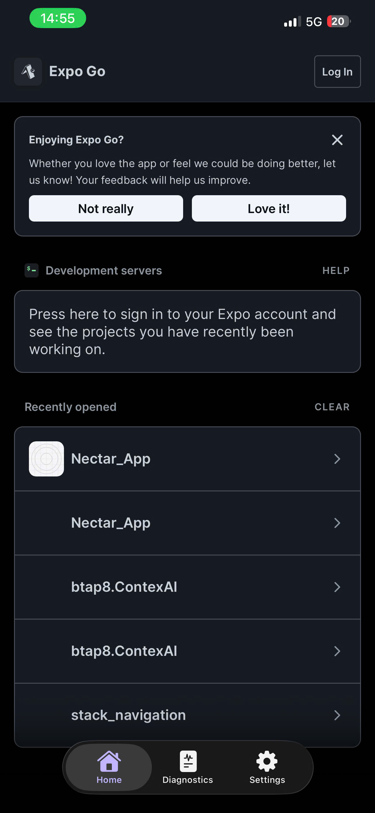 
 
 

**Logout → quay về login screen**

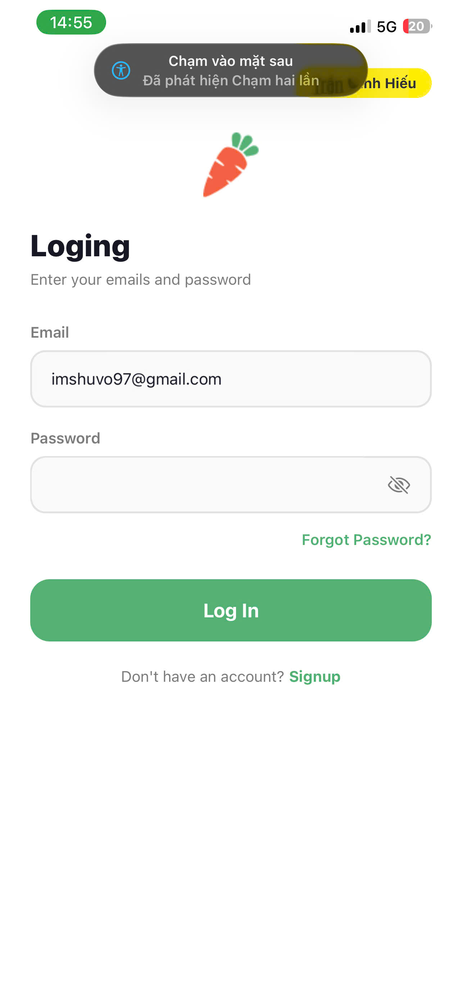

---

#### 🛒 Giỏ hàng

**Thêm sản phẩm vào giỏ**

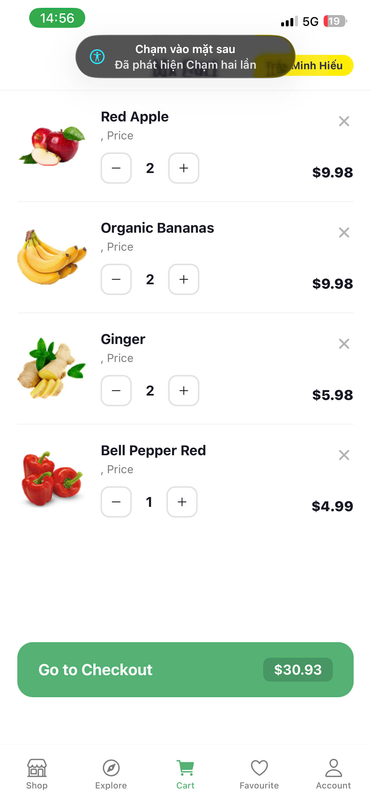

**Tắt app → mở lại giỏ vẫn còn**
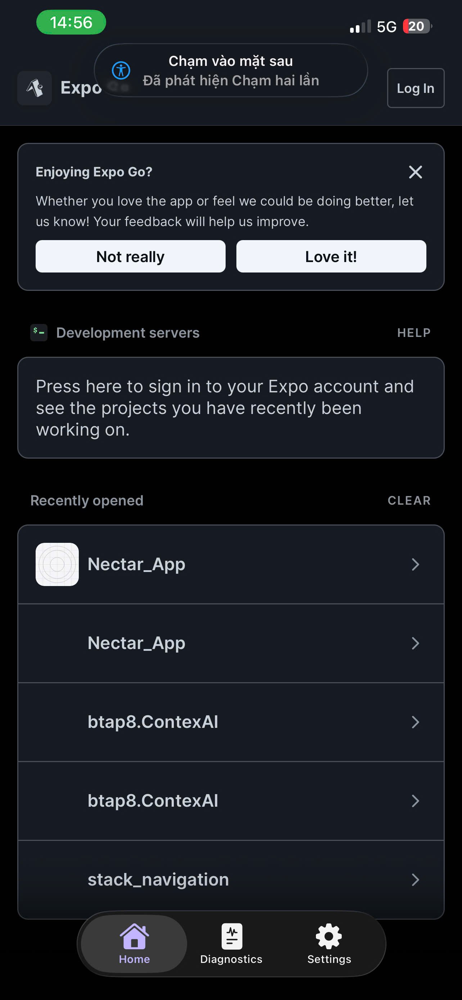
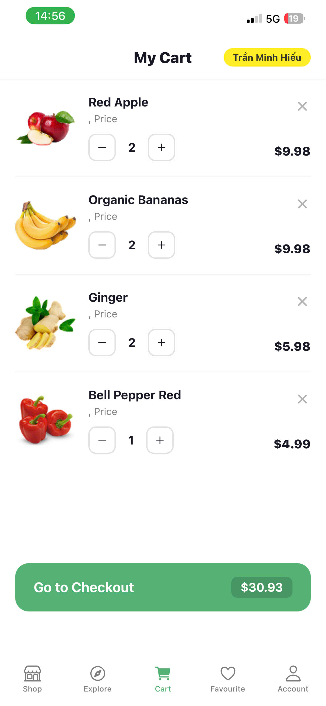

**Thay đổi số lượng sản phẩm**
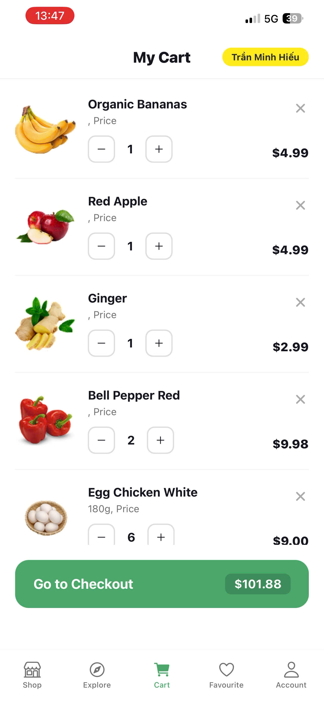
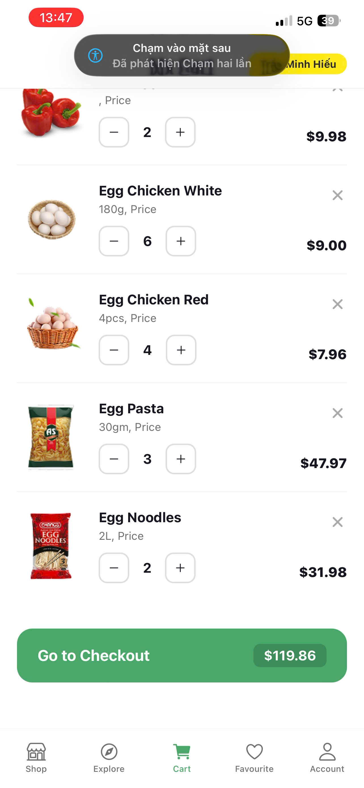
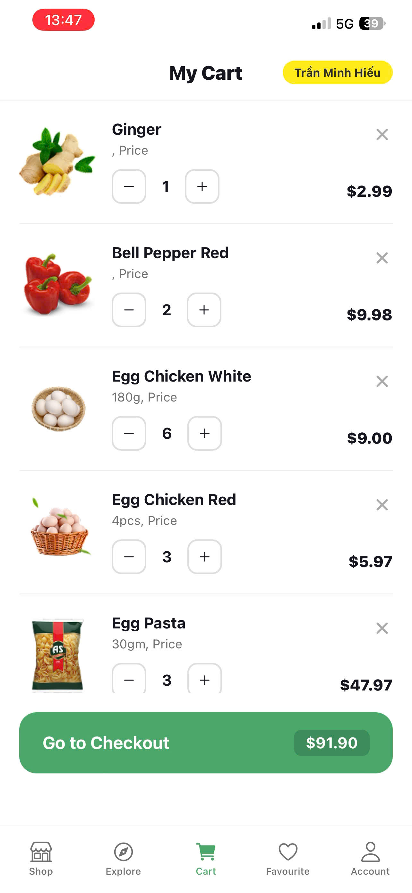
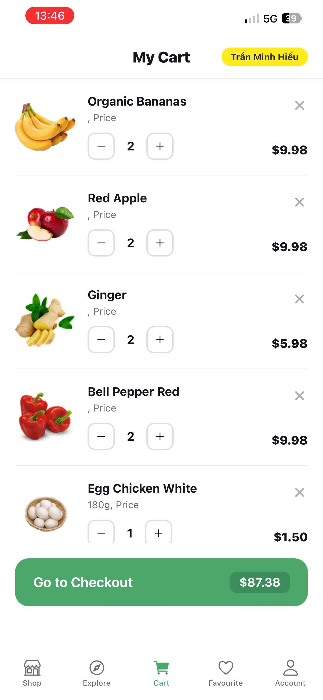
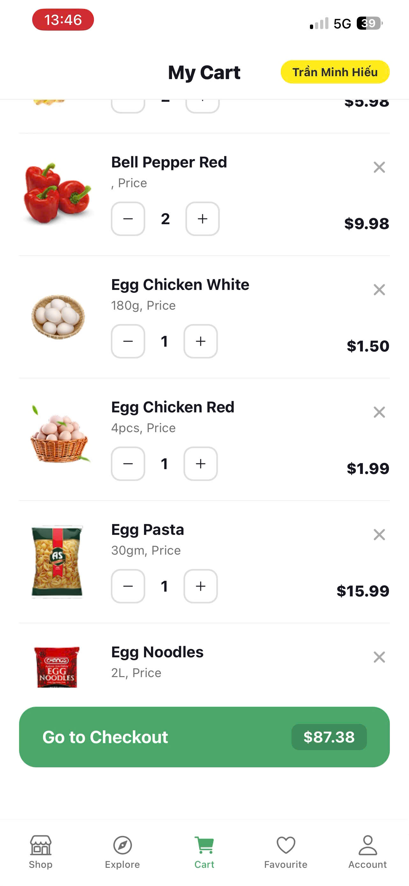

---

#### 📦 Đơn hàng

**Đặt hàng thành công**
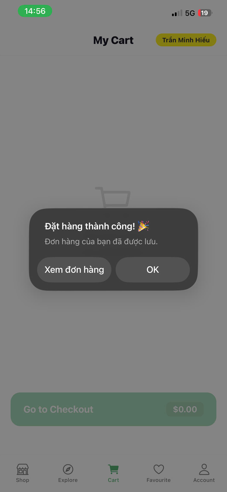
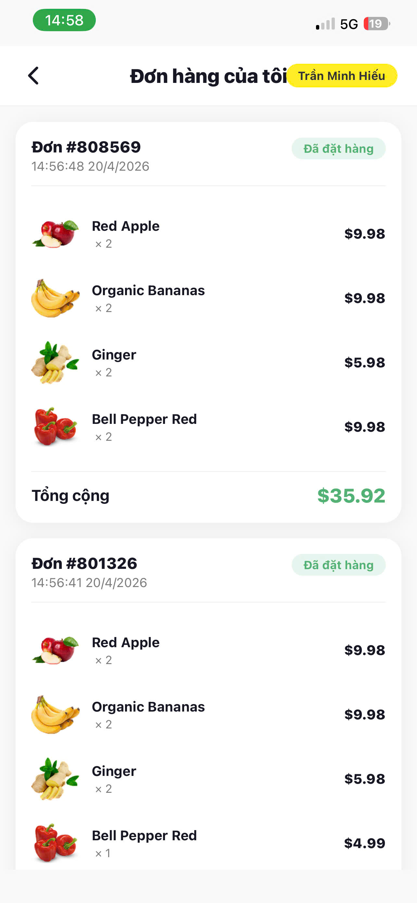

**Danh sách đơn hàng**

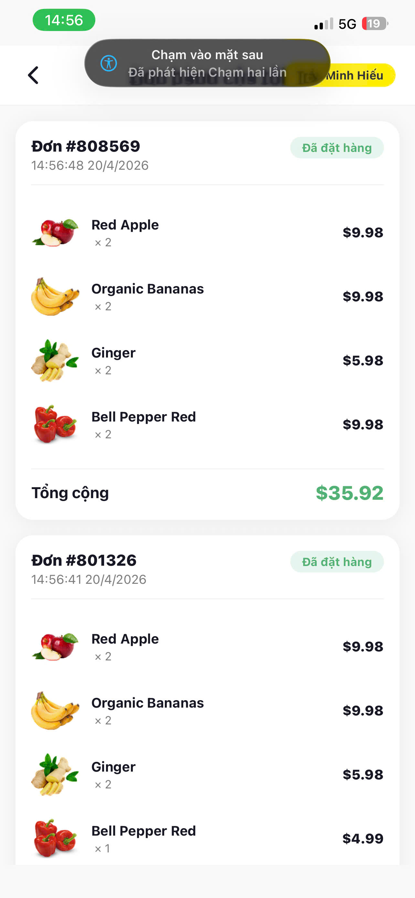

**Reload app vẫn còn đơn hàng**

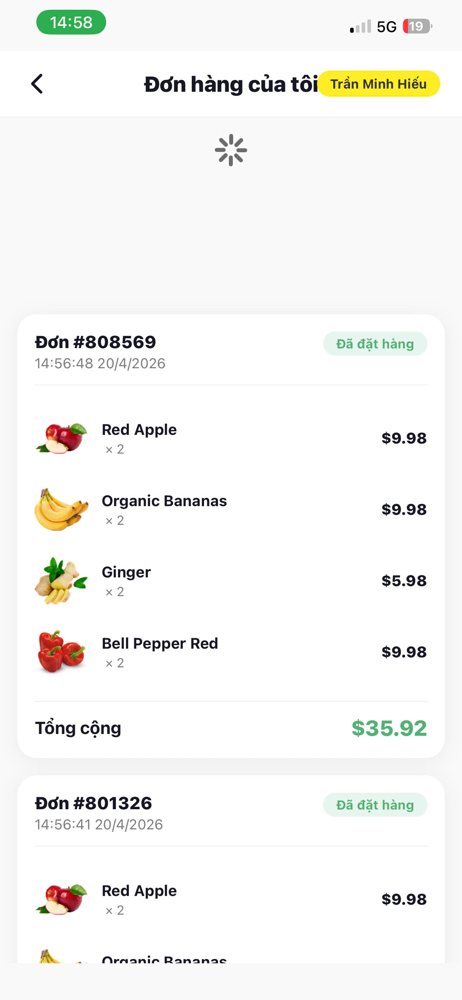

---
### 2. 🎥 Video demo
https://drive.google.com/file/d/18705m7lfdnBeuGindsMMAe5WVFguPNVt/view

### 3. 🐙 GitHub
- **Repo:** https://github.com/HT2K5/Lap_trinh_tren_thiet_bi_di_dong
- **Branch:** `Nectar_App_P4`

| # | Commit | Mô tả |
|---|--------|-------|
| 1 | `init: initialize Nectar App project` | Khởi tạo project |
| 2 | `feat: add AsyncStorage service and custom hook` | Tạo storage.js, useStorage.js |
| 3 | `feat: onboarding and authentication screens` | Màn hình onboarding, đăng ký |
| 4 | `feat: login with user session saved to AsyncStorage` | Đăng nhập, lưu session |
| 5 | `feat: auto login with AsyncStorage on app start` | Tự động đăng nhập |
| 6 | `feat: add home, cart, orders and account screens` | Màn hình chính |
| 7 | `feat: cart persistence with AsyncStorage` | Giỏ hàng lưu AsyncStorage |
| 8 | `feat: orders history saved to AsyncStorage` | Lịch sử đơn hàng |
| 9 | `feat: logout clears all data from AsyncStorage` | Đăng xuất xóa dữ liệu |

---

## ❓ Trả lời 3 câu hỏi

### 1. AsyncStorage hoạt động như thế nào?

AsyncStorage là một hệ thống lưu trữ **key-value bất đồng bộ** được cung cấp
bởi React Native, cho phép lưu dữ liệu cục bộ trên thiết bị mà không cần
kết nối mạng hay server.

**Cách hoạt động:**
- Dữ liệu được lưu dưới dạng **chuỗi string** trên bộ nhớ thiết bị
- Vì chỉ lưu được string nên phải dùng `JSON.stringify()` để chuyển object
  thành string trước khi lưu, và `JSON.parse()` để chuyển ngược lại khi đọc
- Tất cả các thao tác đều là **bất đồng bộ (async)** nên phải dùng
  `async/await` hoặc `.then()` để xử lý
- Dữ liệu được lưu **vĩnh viễn** trên thiết bị, không bị mất khi tắt app,
  chỉ mất khi người dùng xóa app hoặc gọi `AsyncStorage.clear()`

**Trong dự án Nectar App sử dụng:**
- `saveUser` / `getUser` — lưu thông tin đăng nhập
- `saveCart` / `getCart` — lưu giỏ hàng
- `saveOrder` / `getOrders` — lưu đơn hàng
- `clearAll` — xóa toàn bộ khi logout

---

### 2. Vì sao dùng AsyncStorage thay vì biến state?

**Biến state (useState / useReducer)** chỉ tồn tại trong bộ nhớ RAM của
thiết bị trong khi app đang chạy. Khi người dùng tắt app hoặc thiết bị
khởi động lại, toàn bộ state sẽ bị **xóa hoàn toàn**.

**AsyncStorage** lưu dữ liệu xuống bộ nhớ vật lý của thiết bị nên dữ liệu
tồn tại lâu dài, không phụ thuộc vào việc app có đang chạy hay không.

**So sánh cụ thể:**

| Tình huống | State | AsyncStorage |
|------------|-------|--------------|
| Tắt app rồi mở lại | ❌ Mất dữ liệu | ✅ Vẫn còn |
| Kill app | ❌ Mất dữ liệu | ✅ Vẫn còn |
| Restart điện thoại | ❌ Mất dữ liệu | ✅ Vẫn còn |
| Đang dùng app | ✅ Hoạt động tốt | ✅ Hoạt động tốt |

**Ví dụ thực tế trong Nectar App:**
- Nếu chỉ dùng state để lưu giỏ hàng → người dùng tắt app là mất hết
  sản phẩm đã thêm vào giỏ
- Nếu chỉ dùng state để lưu login → mỗi lần mở app phải đăng nhập lại
- Dùng AsyncStorage → giỏ hàng và thông tin đăng nhập được giữ nguyên
  sau khi tắt và mở lại app

**Kết luận:** State phù hợp để quản lý UI tạm thời trong session hiện tại,
còn AsyncStorage phù hợp để lưu trữ dữ liệu cần giữ lại lâu dài giữa
các lần mở app.

---

### 3. So sánh AsyncStorage với Context API

**Context API** là công cụ của React để **chia sẻ state** giữa các
component mà không cần truyền props qua nhiều tầng. Nó hoạt động hoàn
toàn trong bộ nhớ RAM.

**AsyncStorage** là công cụ để **lưu trữ dữ liệu** xuống bộ nhớ vật lý
của thiết bị một cách bất đồng bộ.

**So sánh chi tiết:**

| Tiêu chí | Context API | AsyncStorage |
|----------|-------------|--------------|
| Vị trí lưu | RAM (bộ nhớ tạm) | Ổ đĩa thiết bị |
| Tắt app | ❌ Mất dữ liệu | ✅ Vẫn còn |
| Tốc độ truy cập | ⚡ Rất nhanh (sync) | 🐢 Chậm hơn (async) |
| Cú pháp | Đồng bộ | Bắt buộc async/await |
| Mục đích | Chia sẻ state giữa components | Lưu trữ lâu dài |
| Giới hạn dung lượng | Không giới hạn (RAM) | ~6MB (tùy thiết bị) |
| Bảo mật | Không mã hóa | Không mã hóa mặc định |
