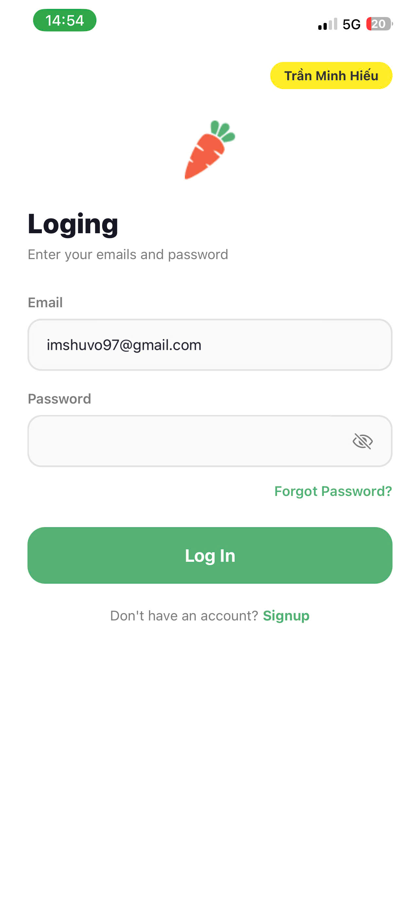
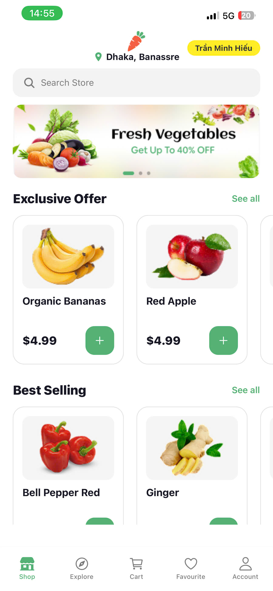
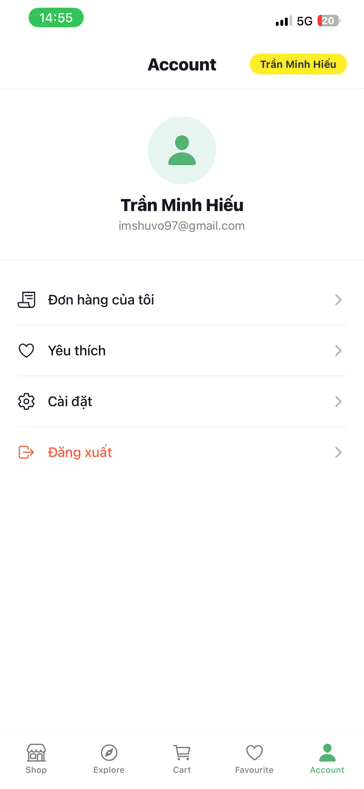

# 🥕 Nectar App - Online Groceries

## 👤 Thông tin sinh viên
- **Họ tên:** Trần Minh Hiếu
- **MSSV:** [23810310175]
- **Môn:** Lập trình trên thiết bị di động
- **Branch:** `Nectar_App_P4`
---

## 📱 Mô tả chức năng

### 🔐 1. Xác thực & Lưu đăng nhập
- Đăng nhập thành công → lưu user vào AsyncStorage
- Mở lại app → tự động đăng nhập (auto login)
- Logout → xóa toàn bộ dữ liệu khỏi storage

### 🛒 2. Giỏ hàng
- Thêm sản phẩm vào giỏ
- Lưu giỏ hàng vào AsyncStorage
- Reload app → dữ liệu vẫn giữ nguyên
- Tăng/giảm số lượng, xóa item
- Pull to refresh để tải lại dữ liệu

### 📦 3. Đơn hàng
- Checkout → lưu đơn hàng vào AsyncStorage
- Hiển thị danh sách đơn hàng
- Mỗi đơn gồm: sản phẩm, tổng tiền, thời gian đặt
- Reload app → vẫn còn đơn hàng

---

## ⚙️ Yêu cầu kỹ thuật
- Sử dụng `@react-native-async-storage/async-storage`
- Dùng `async/await` + `try/catch`
- File riêng: `storage.js`
- Dữ liệu lưu dạng JSON (`JSON.stringify` / `JSON.parse`)

---

## 🚀 Hướng dẫn chạy app

# Clone repo
git clone https://github.com/HT2K5/Lap_trinh_tren_thiet_bi_di_dong.git

# Chuyển sang branch
git checkout Nectar_App_P4

# Cài dependencies
npm install

# Chạy app
npx expo start
Quét QR bằng **Expo Go** trên điện thoại.

---
## ✅ Yêu cầu kiểm chứng
### 1. 📸 Ảnh màn hình

#### 🔐 Xác thực & Đăng nhập
**Đăng nhập thành công**
 
 
 

**Tắt app → mở lại vẫn login**
  
  
  

**Logout → quay về login screen**
 
 